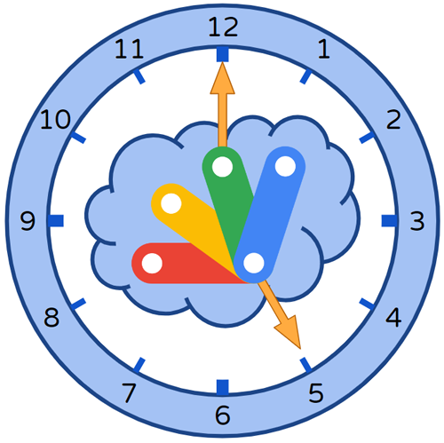

# TriggerApp

<a name="top"></a>
[MIT License](LICENCE)

<a name="overview"></a>

# Overview

This is a Google Apps Script library for efficiently managing the time-driven triggers for executing Google Apps Script using Google Apps Script.



<a name="description"></a>

# Description

Google Apps Script can execute with not only the manual operation but also several triggers. The time-driven trigger is one of them, and this is one of a lot of important functions. When the time-driven trigger is used, Google Apps Script can be automatically executed at the time you set without launching the user's PC.

There are various situations for using time-driven triggers. And, I thought that when I created each script for each situation, the script might tend to be complicated. [Ref](https://tanaikech.github.io/2023/01/18/opening-and-closing-google-forms-on-time-using-google-apps-script/) and [Ref](https://tanaikech.github.io/2021/09/22/executing-function-with-minutes-timer-in-specific-times-using-google-apps-script/) Actually, when I prepared the scripts for each situation in my work, I thought that each script was largely different. I have wished a logic for integrating time-driven triggers for Google Apps Script were existing. Unfortunately, I couldn't find the algorithm for efficiently managing the time-driven triggers for various situations before.

Fortunately, a while ago, I came up with an algorithm using one object. I think that the basic algorithm has been used for a very long time. But, I couldn't find the logic for adapting to various situations using one object. Because, when I started developing a script using this logic, I thought that the script will be much more complicated. Through this, I created this library.

However, I'm worried that the library using this algorithm can be actually used for various situations. So, I have tested various situations with my actual work using this library by taking time. From this test, it was found that it is very useful. So, I would like to publish this library because I believe that this will be useful for a lot of users. This library can efficiently manage time-driven triggers for executing Google Apps Script in various situations with a simple script. If this is useful for your situation, I'm glad.

# Algorithm of this library

The algorithm of this library is straightforward. **An important point of this algorithm is to use one object for managing various trigger tasks.** In order to explain this, the trigger process shown in the following figure is used.


This figure shows the trigger process. For example, when "00:00" is "00:00" of "2024-01-01", "workFunction1", "workFunction2", and "workFunction3" are run as follows.

- "workFunction1": "2024-01-01T00:00:00", "2024-01-01T06:00:00"
- "workFunction2": "2024-01-01T00:30:00",,, "2024-01-01T02:30:00", and "2024-01-01T03:30:00",,, "2024-01-01T05:30:00", and "2024-01-01T06:30:00",,, "2024-01-01T08:30:00".
- "workFunction3": "2024-01-01T03:00:00", "2024-01-01T09:00:00"

When this process is run, I thought that if only the next trigger time for the current time is set by giving one object, the script might be able to be used. When the above image is used,

- When the current date time is "2023-12-31T23:00:00", the following trigger time is "2024-01-01T00:00:00" with "workFunction1".
- When the current date time is "2024-01-01T00:00:00", the following trigger time is "2024-01-01T00:30:00" with "workFunction2".
- This is repeated to the last task.
- When the current date time is "2024-01-01T09:00:00", no next trigger is installed.

In the above flow, this process can be achieved even with only 2 time-driven triggers. Actually, I tested this logic many times, and I could obtain that this can be used. This algorithm can achieve various triggers by installing only 2 time-driven triggers.

I think that when the work function is only one, even with only one time-driven trigger, this process can be achieved. But, in my actual situation, I am required to use multiple work functions. So, in this case, I have given the specification for requiring 2 time-driven triggers.

# Limitations

- The time-driven trigger follows "Current limitations of Quotas for Google Services". [Ref](https://developers.google.com/apps-script/guides/services/quotas#current_limitations)

- When `toDay` is not used, the trigger cycle is repeated to infinity. But., when an error occurs on the internal Google side for some reason, the trigger is stopped. At that time, please run the main function, again. By this, the trigger process is restarted.

- In this library, I set the minimum interval between triggers as 60 seconds. Because, in the current stage, when the minimum interval time is less than 60 seconds, the time-driven trigger cannot be installed by the function executed by the time-driven trigger. I would like to believe that this situation might be resolved in the future update.

- When I tested the time-driven triggers many times using this library, for example, even when the function is trying to execute at "00:00:00", at least, the script is run after "00:00:00" like "00:00:10". It seems that the function was not executed before "00:00:00". But, there were cases where the function is executed at "00:01:30". I guessed that the reason for this issue is due to the Google side. This might be also a limitation.

- I'm not sure whether this has to be included in the "Limitations" section. When you want to execute functions using the "everyYear" property, I'm worried that when it occurs no execution of the script for a long time in the Google Apps Script project, it might be required to reauthorize the scopes. But, in the current stage, I have no experience with this issue. If you got it, please tell me. I believe that it will be useful for other users.

- I believe that this library will be able to adapt to a lot of scenarios for using time-driven triggers. However, on the other hand, I think that this library cannot be used in all scenarios. Please be careful about this.

# Library's project key

```
1LihDPPHWBCcadYVBI3oZ4vOt7XqlowoHyBLdaDgRIx_5OpRBREA7Z1QB
```

<a name="usage"></a>

# Usage

## 1. Install library

In order to use this library, please install the library as follows.

1. Create a GAS project.

   - You can use this library for the GAS project of both the standalone and container-bound script types.

1. [Install this library](https://developers.google.com/apps-script/guides/libraries).

   - Library's project key is **`1LihDPPHWBCcadYVBI3oZ4vOt7XqlowoHyBLdaDgRIx_5OpRBREA7Z1QB`**.

# Scopes

This library uses the following 1 scope. This scope is used for installing the time-driven triggers.

- `https://www.googleapis.com/auth/script.scriptapp`

# Methods

| Methods                                                 | Description                                                                                                                                                                                                                                                                                                           |
| :------------------------------------------------------ | :-------------------------------------------------------------------------------------------------------------------------------------------------------------------------------------------------------------------------------------------------------------------------------------------------------------------- |
| [setEventObject](#seteventobject)                       | (Require) Give the event object from the time-driven trigger.                                                                                                                                                                                                                                                         |
| [setCustomNow](#setcustomnow)                           | When this method is used, the custom current date time can be used. If this is not used, the current date time is used. This will be used for simulating the triggers.                                                                                                                                                |
| [setDiffTriggerTime](#setdiffrriggerrime)               | Unit is second. The default value is 60 seconds. Difference of trigger time between "ownFunctionName" and "functionName". When this value is small, the trigger is reset by "ownFunctionName". By this, "functionName" is not run. Please adjust this value from your script of "functionName" of your work function. |
| [setEase](#setease)                                     | Unit is second. The default value is 0 s. When the date time of a new trigger is calculated, if you want to give a wait time, you can set it using this method.                                                                                                                                                       |
| [setScriptWaitTime](#setscriptwaittime)                 | Unit is second. The default value is 0 s. When the script is run, when the date time for the next trigger time is very small, you can avoid this by this method.                                                                                                                                                      |
| [setTriggerOffsetTime](#settriggeroffsettime)           | Unit is second. The default value is 0. When the trigger time is just time and an error occurs, increase this value. But, most cases will be worked with 0.                                                                                                                                                           |
| [setMaxOutputForSimulation](#setmaxoutputforsimulation) | Default value is 20. When the simulation of triggers is run, set the maximum number of results. When "toDay" is not set in the inputted object, the infinite results are returned. This is used for fixing the number of results. When "toDay" is set in the inputted object, all results are returned.               |
|                                                         |                                                                                                                                                                                                                                                                                                                       |
| [installTriggers](#installtriggers)                     | This is the main method of this library. By giving the parameters, the specific functions are executed by the time-driven triggers.                                                                                                                                                                                   |
| [installTriggersByData](#installtriggersbydata)         | This method installs the tasks given by data output from "simulateTriggers" method as the time-driven trigger.                                                                                                                                                                                                        |
| [simulateTriggers](#simulatetriggers)                   | This method can simulate the time-driven triggers by inputting the actual object for the setTriggers method.                                                                                                                                                                                                          |
|                                                         |                                                                                                                                                                                                                                                                                                                       |
| [deleteAllTriggers](#deletealltriggers)                 | Delete all project triggers of the current Google Apps Script project. This method can be used independently from other methods.                                                                                                                                                                                      |

<a name="seteventobject"></a>

## setEventObject

(Require) This method gives the event object from the time-driven trigger.

The sample script is as follows.

```javascript
function sample(e) {
  const obj = [
    {
      ownFunctionName: "sample",
      functionName: "sampleFunction",
      everyDay: true,
      interval: 600,
      fromTime: "09:00",
      toTime: "17:00",
    },
  ];
  const res = TriggerApp.setEventObject(e).simulateTriggers(obj, console.log);
  console.log(res);
}
```

- In this case, the event object `e` of `sample(e)` is used as `e` of `setEventObject(e)`.

<a name="setcustomnow"></a>

## setCustomNow

When this method is used, the custom current date time can be used. If this is not used, the current date time is used. This will be used for simulating the triggers.

The sample script is as follows.

```javascript
function sample(e) {
  const obj = [
    {
      ownFunctionName: "sample",
      functionName: "sampleFunction",
      everyDay: true,
      interval: 600,
      fromTime: "09:00",
      toTime: "17:00",
    },
  ];
  const now = new Date("2023-01-01T00:00:00.000");
  const res = TriggerApp.setEventObject(e)
    .setCustomNow(now)
    .simulateTriggers(obj, console.log);
  console.log(res);
}
```

- In this case, the trigger tasks can be simulated by the custom current time like `new Date("2023-01-01T00:00:00.000")`.

<a name="setdiffrriggerrime"></a>

## setDiffTriggerTime

Unit is second. The default value is 60 seconds. Difference of trigger time between "ownFunctionName" and "functionName". When this value is small, the trigger is reset by "ownFunctionName". By this, "functionName" is not run. Please adjust this value from your script of "functionName" of your work function.

The sample script is as follows.

```javascript
function sample(e) {
  const obj = [
    {
      ownFunctionName: "sample",
      functionName: "sampleFunction",
      everyDay: true,
      interval: 600,
      fromTime: "09:00",
      toTime: "17:00",
    },
  ];
  const res = TriggerApp.setEventObject(e)
    .setDiffTriggerTime(120)
    .installTriggers(obj, console.log);
  console.log(res);
}
```

- In this script, the function `sample` for calculating the next trigger time is run 2 minutes after the work function `sampleFunction` was run.

### IMPORTANT

As an important point, when you want to run the script every 1 minute, please set this value to less than 60 seconds. Because, in the case of the default value of 60 seconds, "ownFunctionName" and the next run of "functionName" is run simultaneously. But, when I tested a lot of times about the time-driven trigger, the script cannot be run at just time because of Google side. So, please be careful when you run the script every 1 minute.

<a name="setease"></a>

## setEase

Unit is second. The default value is 0 s. When the date time of a new trigger is calculated, if you want to give a wait time, you can set it using this method.

The sample script is as follows.

```javascript
function sample(e) {
  const obj = [
    {
      ownFunctionName: "sample",
      functionName: "sampleFunction",
      everyDay: true,
      interval: 600,
      fromTime: "09:00",
      toTime: "17:00",
    },
  ];
  const res = TriggerApp.setEventObject(e)
    .setEase(10)
    .simulateTriggers(obj, console.log);
  console.log(res);
}
```

- In this script, the trigger times are calculated by `now + ease`. In this case, when you see the actual script in this repository, it might be useful for understanding this.

<a name="setscriptwaittime"></a>

## setScriptWaitTime

Unit is second. The default value is 0 s. When the script is run, when the date time for the next trigger time is very small, you can avoid this by this method.

The sample script is as follows.

```javascript
function sample(e) {
  const obj = [
    {
      ownFunctionName: "sample",
      functionName: "sampleFunction",
      everyDay: true,
      interval: 600,
      fromTime: "09:00",
      toTime: "17:00",
    },
  ];
  const res = TriggerApp.setEventObject(e)
    .setScriptWaitTime(10)
    .simulateTriggers(obj, console.log);
  console.log(res);
}
```

- In this script, when `sample` is run, the script is run after 10 seconds. In this case, when you see the actual script in this repository, it might be useful for understanding this.

<a name="settriggeroffsettime"></a>

## setTriggerOffsetTime

Unit is second. The default value is 0. When the trigger time is just time and an error occurs, increase this value. But, most cases will be worked with 0.

The sample script is as follows.

```javascript
function sample(e) {
  const obj = [
    {
      ownFunctionName: "sample",
      functionName: "sampleFunction",
      everyDay: true,
      interval: 600,
      fromTime: "09:00",
      toTime: "17:00",
    },
  ];
  const res = TriggerApp.setEventObject(e)
    .setTriggerOffsetTime(10)
    .simulateTriggers(obj, console.log);
  console.log(res);
}
```

- In this script, when the next trigger is calculated, 10 seconds are increased to it. In this case, when you see the actual script in this repository, it might be useful for understanding this.

<a name="setmaxoutputforsimulation"></a>

## setMaxOutputForSimulation

The default value is 20. When the simulation of triggers is run, set the maximum number of results. When "toDay" is not set in the inputted object, the infinite results are returned. This is used for fixing the number of results. When "toDay" is set in the inputted object, all results are returned.

The sample script is as follows.

```javascript
function sample(e) {
  const obj = [
    {
      ownFunctionName: "sample",
      functionName: "sampleFunction",
      everyDay: true,
      interval: 600,
      fromTime: "09:00",
      toTime: "17:00",
    },
  ];
  const res = TriggerApp.setEventObject(e)
    .setMaxOutputForSimulation(5)
    .simulateTriggers(obj, console.log);
  console.log(res);
}
```

- In this sample, the trigger times can be simulated. The trigger times using this `obj` are returned. This can be used for checking whether `obj` is correctly run with your expected trigger times without directly testing the triggers. In this case, only 5 data is returned by `setMaxOutputForSimulation(5)`.

<a name="installtriggers"></a>

## installTriggers

This is the main method of this library. By giving the parameters, the specific functions are executed by the time-driven triggers.

The sample script is as follows.

```javascript
function sample(e) {
  const obj = [
    {
      ownFunctionName: "sample",
      functionName: "sampleFunction",
      everyDay: true,
      interval: 600,
      fromTime: "09:00",
      toTime: "17:00",
    },
  ];
  const res = TriggerApp.setEventObject(e).installTriggers(obj, console.log);
  console.log(res);
}
```

- In this sample, for example, when the now time is "2023-01-01 00:00:00" in your timezone, the function of "sampleFunction" is run at the trigger times of "2023-01-01 09:00:00", "2023-01-01 09:10:00",,,"2023-01-01 17:00:00", "2023-01-02 09:00:00", "2023-01-02 09:10:00",,,"2023-01-02 17:00:00",,,.

- About the value of "obj", the various patterns can be used. I would like to introduce the sample patterns for understanding this in the below ["Sample scenarios"](#samplescenarios) section.

<a name="installtriggersbydata"></a>

## installTriggersByData

This method installs the trigger tasks given by data obtained by "simulateTriggers" method as the time-driven trigger.

The sample script is as follows.

```javascript
function sample(e) {
  const obj = {
    ownFunctionName: "sample",
    data: [
      {
        triggerTime: new Date("2024-01-01T01:00:00"),
        executeFunction: "sampleFunction",
      },
      {
        triggerTime: new Date("2024-01-01T10:00:00"),
        executeFunction: "sampleFunction",
      },
    ],
  };
  const res = TriggerApp.setEventObject(e).installTriggersByData(obj);
  console.log(res);
}
```

- In this case, `obj.data` is the trigger task obtained by "simulateTriggers" method. Please be careful about this.

- In this sample, for example, when the current date is `2024-01-01T02:00:00`, "sampleFunction" is run at "2024-01-01T01:00:00" and "2024-01-01T10:00:00".

- The values of `obj.data` can be retrieved by the following `simulateTriggers`. [Ref](#simulatetriggers)

<a name="simulatetriggers"></a>

## simulateTriggers

This method can simulate the time-driven triggers by inputting the actual object for the setTriggers method. For example, before you run `installTriggers`, you can confirm whether your object `obj` is a valid value for achieving your expected result.

The sample script is as follows.

```javascript
function sample(e) {
  const obj = [
    {
      ownFunctionName: "sample",
      functionName: "sampleFunction",
      everyDay: true,
      interval: 600,
      fromTime: "09:00",
      toTime: "17:00",
    },
  ];
  const res = TriggerApp.setEventObject(e).simulateTriggers(obj, console.log);
  console.log(res);
}
```

In this sample, the trigger times can be simulated. The trigger times using this `obj` are returned. This can be used for checking whether `obj` is correctly running with your expected trigger times without directly testing the triggers.

For example, when "setCustomNow" method is used, you can simulate the trigger tasks with the custom date time as follows.

```javascript
function sample(e) {
  const obj = [
    {
      ownFunctionName: "sample",
      functionName: "sampleFunction",
      everyDay: true,
      interval: 600,
      fromTime: "09:00",
      toTime: "17:00",
    },
  ];
  const now = new Date("2024-01-01T00:00:00.000");
  const res = TriggerApp.setEventObject(e)
    .setCustomNow(now)
    .simulateTriggers(obj, console.log);
  console.log(res);
}
```

<a name="deletealltriggers"></a>

## deleteAllTriggers

Delete all project triggers of the current Google Apps Script project. This method can be used independently from other methods.

The sample script is as follows.

```javascript
function deleteAllTriggers() {
  TriggerApp.deleteAllTriggers();
}
```

- This script deletes all triggers of this Google Apps Script project.

# Object for installTriggers and simulateTriggers

In this library, an object is used for executing the time-driven trigger. It's `obj` of `installTriggers(obj, console.log)` and `simulateTriggers(obj, console.log)`. There are several important rules for this object.

1. `obj` is required to be an array including JSON object.
2. The JSON object has the following 12 properties. In this library, the time-driven triggers for various situations can be achieved by combining these properties.
   - ownFunctionName: string: Function name of the function for running `installTriggers` and `simulateTriggers`.
   - functionName: string: Function name of the function you want to run with the time-driven trigger.
   - everyDay: boolean: When this is true, the trigger is run every day.
   - everyWeek: string[]: When `["Monday", "Friday"]` is set, the trigger is run at "Monday" and "Friday" in every week.
   - everyMonth: number[]: When `[1, 5]` is set, the trigger is run at 1st day and 5th day in every month.
   - everyYear: string[]: When `["2023-07-15", "2023-09-15"]` is set, the trigger is run at July, 15, and September 15 in every year.
   - interval: number: Unit is seconds. When `600` is set, the trigger is run every 600 seconds. This is used together with `everyDay`, `everyWeek`, `everyMonth`, and `everyYear`.
   - atTimes: string[]: When `["09:00","15:00"]` is set, the trigger is run at "09:00" and "15:00". This is used together with `everyDay`, `everyWeek`, `everyMonth`, and `everyYear`.
   - fromDay: string: RFC 3339. When `2023-10-01T00:00:00.000Z` is set, the trigger is run from it. If this is not used, the current time is used as `fromDay`.
   - toDay: string: RFC 3339. When `2023-10-01T00:00:00.000Z` is set, the trigger is run to it. If this is not used, the trigger is repeated infinity.
   - fromTime: string: When `"09:00"` is used, the triggers of `interval` is run from it.
   - toTime: string: When `"17:00"` is used, the triggers of `interval` is run to it.

I'm worried that it might be difficult to completely understand the method for using this library by only the above explanation. So, I would like to introduce my actual object for using this library in the next section. I believe that knowing the situation I am using might lead to understanding this library.

<a name="samplescenarios"></a>

# Sample scenarios

Here, I would like to introduce several scenarios for managing the time-driven triggers using this library. I am actually using these all scenarios in my work. I believe that you can use this library by referring to these scenarios.

**Here, as a sample current time in order to explain these scenarios, `new Date("2024-01-01T00:00:00.000")` is used.**

## Scenario 1

Run "sampleFunction1" and "sampleFunction2" at "2024-01-15T09:00:00" and "2024-02-25T10:00:00" only one time, respectively.

```javascript
function sample(e) {
  const obj = [
    {
      ownFunctionName: "sample",
      functionName: "sampleFunction1",
      everyMonth: [15],
      atTimes: ["09:00:00"],
      fromDay: "2024-01-15T00:00:00.000",
      toDay: "2024-01-16T00:00:00.000",
    },
    {
      ownFunctionName: "sample",
      functionName: "sampleFunction2",
      everyMonth: [25],
      atTimes: ["10:00:00"],
      fromDay: "2024-02-25T00:00:00.000",
      toDay: "2024-02-26T00:00:00.000",
    },
  ];
  const res = TriggerApp.setEventObject(e).installTriggers(obj, console.log);
  console.log(res);
}
```

For example, when `const res = TriggerApp.setEventObject(e).installTriggers(obj, console.log)` is replaced with `const res = TriggerApp.setEventObject(e).simulateTriggers(obj)`, this process can be simulated. When the above `obj` is used, the following result is returned.

```json
[
  {
    "triggerTime": "2024-01-15T09:00:00",
    "executeFunction": "sampleFunction1"
  },
  { "triggerTime": "2024-02-25T10:00:00", "executeFunction": "sampleFunction2" }
]
```

From this result, it is found that the value of `obj` is a valid value for using `installTriggers` and the expected process can be achieved. After you confirmed the process of triggers by this simulation, you can actually run `obj` with `installTriggers`.

For example, the following object obtains the same result as the above one. There are several patterns for achieving the same process by combining the properties of `obj`.

```javascript
function sample(e) {
  const obj = [
    {
      ownFunctionName: "sample",
      functionName: "sampleFunction1",
      everyYear: ["2024-01-15"],
      atTimes: ["09:00:00"],
      fromDay: "2024-01-01T00:00:00.000",
      toDay: "2024-02-01T00:00:00.000",
    },
    {
      ownFunctionName: "sample",
      functionName: "sampleFunction2",
      everyYear: ["2024-02-25"],
      atTimes: ["10:00:00"],
      fromDay: "2024-02-01T00:00:00.000",
      toDay: "2024-03-01T00:00:00.000",
    },
  ];
  const res = TriggerApp.setEventObject(e).installTriggers(obj, console.log);
  console.log(res);
}
```

## Scenario 2

Run "sampleFunction" every 30 minutes from "10:00" to "15:00" on the 5th, 15th, and 25th of every month. This process is run from now ("2024-01-01T00:00:00) to "2024-06-01T00:00:00".

In this case, if `toDay: "2024-06-01T00:00:00.000",` is removed, this process is run with infinite without stopping.

```javascript
function sample(e) {
  const obj = [
    {
      ownFunctionName: "sample",
      functionName: "sampleFunction",
      everyMonth: [5, 15, 25],
      interval: 1800,
      fromTime: "10:00",
      toTime: "15:00",
      toDay: "2024-06-01T00:00:00.000",
    },
  ];
  const res = TriggerApp.setEventObject(e).installTriggers(obj, console.log);
  console.log(res);
}
```

## Scenario 3

These trigger tasks are run on Monday, Tuesday, Wednesday, Thursday, and Friday every week.

1. At "09:00:00", "sampleFunction1" is run.
2. From "09:10:00" to "12:00:00", "sampleFunction2" is run every 10 minutes.
3. From "13:00:00" to "16:50:00", "sampleFunction2" is run every 10 minutes.
4. At "17:00:00", "sampleFunction3" is run.

The sample script for this flow is as follows.

```javascript
function sample(e) {
  const obj = [
    {
      ownFunctionName: "sample",
      functionName: "sampleFunction1",
      everyWeek: ["Monday", "Tuesday", "Wednesday", "Thursday", "Friday"],
      atTimes: ["09:00:00"],
    },
    {
      ownFunctionName: "sample",
      functionName: "sampleFunction2",
      everyWeek: ["Monday", "Tuesday", "Wednesday", "Thursday", "Friday"],
      interval: 600,
      fromTime: "09:10",
      toTime: "12:00",
    },
    {
      ownFunctionName: "sample",
      functionName: "sampleFunction2",
      everyWeek: ["Monday", "Tuesday", "Wednesday", "Thursday", "Friday"],
      interval: 600,
      fromTime: "13:00",
      toTime: "16:50",
    },
    {
      ownFunctionName: "sample",
      functionName: "sampleFunction3",
      everyWeek: ["Monday", "Tuesday", "Wednesday", "Thursday", "Friday"],
      atTimes: ["17:00:00"],
    },
  ];
  const res = TriggerApp.setEventObject(e).installTriggers(obj, console.log);
  console.log(res);
}
```

## Scenario 4

When you want to send an email on a birthday, the following sample script is used. As a sample, it supposes that the birthday is October 1st. And, here, as a sample current time in order to explain these scenarios, `new Date("2024-01-01T00:00:00.000")` is used.

```javascript
function sample(e) {
  const obj = [
    {
      ownFunctionName: "sample",
      functionName: "sampleFunction",
      everyYear: ["2024-10-01"],
      atTimes: ["09:00:00"],
    },
  ];
  const res = TriggerApp.setEventObject(e).installTriggers(obj, console.log);
  console.log(res);
}
```

- By this, "sampleFunction" is run at "2024-10-01T09:00:00", "2025-10-01T09:00:00", "2026-10-01T09:00:00",,,.

## Scenario 5

The specific functions are run on specific weekdays of the week.

```javascript
function sample(e) {
  const obj = [
    {
      ownFunctionName: "sample",
      functionName: "sampleFunction1",
      everyWeek: ["Monday", "Wednesday", "Friday"],
      interval: 600,
      fromTime: "09:00",
      toTime: "12:00",
    },
    {
      ownFunctionName: "sample",
      functionName: "sampleFunction2",
      everyWeek: ["Tuesday", "Thursday", "Saturday"],
      interval: 600,
      fromTime: "13:00",
      toTime: "17:00",
    },
  ];
  const res = TriggerApp.setEventObject(e).installTriggers(obj, console.log);
  console.log(res);
}
```

- When this script is run, the following process is run.
- Function "sampleFunction1" is run from "09:00" to "12:00" every 10 minutes on Monday, Wednesday, and Friday.
- Function "sampleFunction2" is run from "13:00" to "17:00" every 10 minutes on Tuesday, Thursday, and Saturday.

## Scenario 6

6 functions of "sampleFunction1", "sampleFunction2", "sampleFunction3", "sampleFunction4" "sampleFunction5", and "sampleFunction6" are run every 10 minutes from "09:00:00" to "11:50:00" in order.

```javascript
function sample(e) {
  const n = 18;
  let start = new Date();
  start.setHours(9, 0, 0, 0);
  const ar1 = Array(n).fill(null);
  const obj = [...Array(Math.ceil(ar1.length / 6))].flatMap((_, i) =>
    ar1.splice(0, 6).map((_, j) => {
      const temp = {
        ownFunctionName: "sample",
        functionName: `sampleFunction${j + 1}`,
        everyDay: true,
        atTimes: [
          Utilities.formatDate(start, Session.getScriptTimeZone(), "HH:mm:ss"),
        ],
      };
      start = new Date(start.getTime() + 10 * 60 * 1000);
      return temp;
    })
  );
  const res = TriggerApp.setEventObject(e).installTriggers(obj, console.log);
  console.log(res);
}
```

- When this script is run at "2024-01-01T00:00:00", 6 functions of "sampleFunction1", "sampleFunction2", "sampleFunction3", "sampleFunction4" "sampleFunction5", and "sampleFunction6" are executed as follows. This value is from "simulateTriggers" method.

```json
[
  {
    "triggerTime": "2024-01-01T09:00:00",
    "executeFunction": "sampleFunction1"
  },
  {
    "triggerTime": "2024-01-01T09:10:00",
    "executeFunction": "sampleFunction2"
  },
  {
    "triggerTime": "2024-01-01T09:20:00",
    "executeFunction": "sampleFunction3"
  },
  {
    "triggerTime": "2024-01-01T09:30:00",
    "executeFunction": "sampleFunction4"
  },
  {
    "triggerTime": "2024-01-01T09:40:00",
    "executeFunction": "sampleFunction5"
  },
  {
    "triggerTime": "2024-01-01T09:50:00",
    "executeFunction": "sampleFunction6"
  },
  {
    "triggerTime": "2024-01-01T10:00:00",
    "executeFunction": "sampleFunction1"
  },
  {
    "triggerTime": "2024-01-01T10:10:00",
    "executeFunction": "sampleFunction2"
  },
  {
    "triggerTime": "2024-01-01T10:20:00",
    "executeFunction": "sampleFunction3"
  },
  {
    "triggerTime": "2024-01-01T10:30:00",
    "executeFunction": "sampleFunction4"
  },
  {
    "triggerTime": "2024-01-01T10:40:00",
    "executeFunction": "sampleFunction5"
  },
  {
    "triggerTime": "2024-01-01T10:50:00",
    "executeFunction": "sampleFunction6"
  },
  {
    "triggerTime": "2024-01-01T11:00:00",
    "executeFunction": "sampleFunction1"
  },
  {
    "triggerTime": "2024-01-01T11:10:00",
    "executeFunction": "sampleFunction2"
  },
  {
    "triggerTime": "2024-01-01T11:20:00",
    "executeFunction": "sampleFunction3"
  },
  {
    "triggerTime": "2024-01-01T11:30:00",
    "executeFunction": "sampleFunction4"
  },
  {
    "triggerTime": "2024-01-01T11:40:00",
    "executeFunction": "sampleFunction5"
  },
  {
    "triggerTime": "2024-01-01T11:50:00",
    "executeFunction": "sampleFunction6"
  },
  {
    "triggerTime": "2024-01-02T09:00:00",
    "executeFunction": "sampleFunction1"
  },
  {
    "triggerTime": "2024-01-02T09:10:00",
    "executeFunction": "sampleFunction2"
  },
  ,
  ,
  ,
]
```

## Scenario 7

When you want to execute 2 different functions at the same date time, please use the following sample script.

```javascript
function sample1(e) {
  const obj = [
    {
      ownFunctionName: "sample1",
      functionName: "sampleFunction1",
      everyMonth: [15],
      atTimes: ["09:00:00"],
      toDay: "2024-02-01T00:00:00.000",
    },
  ];
  const res = TriggerApp.setEventObject(e).installTriggers(obj, console.log);
  console.log(res);
}

function sample2(e) {
  const obj = [
    {
      ownFunctionName: "sample2",
      functionName: "sampleFunction2",
      everyMonth: [15],
      atTimes: ["09:00:00"],
      toDay: "2024-02-01T00:00:00.000",
    },
  ];
  const res = TriggerApp.setEventObject(e).installTriggers(obj, console.log);
  console.log(res);
}
```

In this case, please separate the main functions like above. And, when `sample1` and `sample2` are run, each trigger tasks are installed.

When the following script is run, an error of `Error: The interval between the current trigger and the next trigger is small.` occurs. Please be careful about this.

```javascript
// This script occurs an error like "Error: The interval between the current trigger and the next trigger is small.".
function sample(e) {
  const obj = [
    {
      ownFunctionName: "sample",
      functionName: "sampleFunction1",
      everyMonth: [15],
      atTimes: ["09:00:00"],
      toDay: "2024-02-01T00:00:00.000",
    },
    {
      ownFunctionName: "sample",
      functionName: "sampleFunction2",
      everyMonth: [15],
      atTimes: ["09:00:00"],
      toDay: "2024-02-01T00:00:00.000",
    },
  ];
  const res = TriggerApp.setEventObject(e).installTriggers(obj, console.log);
  console.log(res);
}
```

## Other samples

You can see it on [my Medium page](https://medium.com/google-cloud/easily-managing-time-driven-triggers-using-google-apps-script-7fa48546b4e7).

# Note

- I think that there are many more various scenarios for executing Google Apps Script with time-driven triggers. So, when you use this library and you have other scenarios and provide them, I believe that those will be useful for a lot of users. I would like to publish your scenarios in this repository.

- When the trigger task is stopped by the internal server side, please run the function of `ownFunctionName`, again. By this, the trigger task is resumed from the time the script is run.

- For example, when you want to run multiple functions (like "sample1", "sample2", and "sample3" in order) at the same time, please wrap them as one function as follows.

  ```javascript
  function sample1() {
    // Do something
  }

  function sample2() {
    // Do something
  }

  function sample3() {
    // Do something
  }

  function wrappedSamples() {
    sample1();
    sample2();
    sample3();
  }
  ```

  - When "wrappedSamples" is set as the time-driven trigger, 3 functions are run in order.

---

<a name="licence"></a>

# Licence

[MIT](LICENCE)

<a name="author"></a>

# Author

[Tanaike](https://tanaikech.github.io/about/)

[Donate](https://tanaikech.github.io/donate/)

<a name="updatehistory"></a>

# Update History

- v1.0.0 (July 16, 2023)

  1. Initial release.

[TOP](#top)
